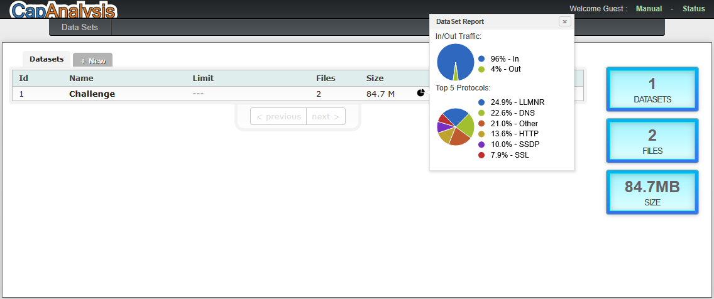

# Capanalysis Traffic Analysis

## Description
Traffic analysis using CapAnalysis.

## Tools
- CapAnalysis

## Findings
- QUIC was the dominant protocol 
- TOR traffic detected 
- BitTorrent and Dropbox activity observed 
- Amazon traffic identified
- Total traffic volume: 77.5 MB
- Highest traffic IP: 192.168.0.136 (25.4%)
- Traffic mainly destined to: USA

## Analysis

## Lessons Learned
- Traffic analysis reveals protocols and behavior
- Even without payload, patterns are visible
